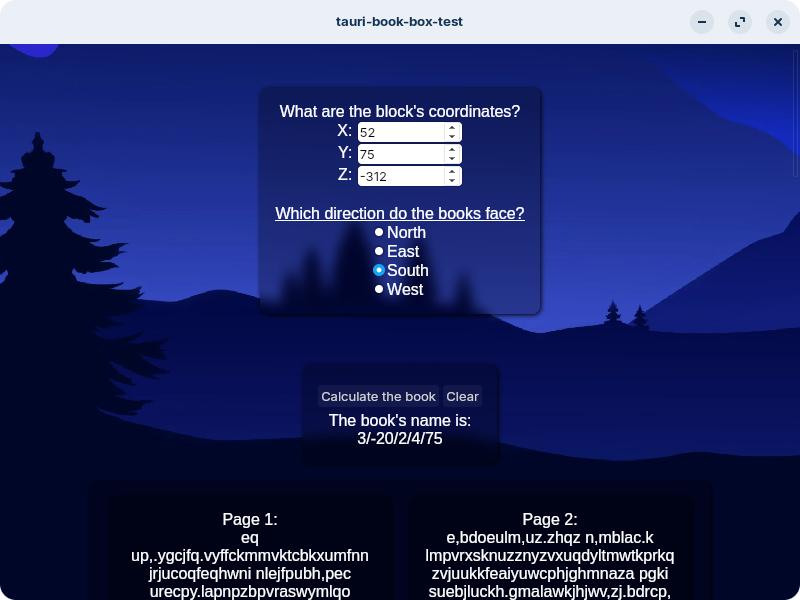

# tauri-book-box-test
A test app to get used to Tauri, desktop version of the Book Box Generator from my website (https://www.yoshomay.com/projects/bookBox).

# Build instructions
To build you'll have to have tauri setup on your system by going through this page https://v2.tauri.app/start/prerequisites/
    
##For Linux builds
    You must be running Linux/wsl to compile, either that or use something like docker or github actions
    
    Run `npm install`
    Then run `cd src-tauri/` to go into the source folder
    Now just run `npm run tauri build`

    The .deb will be located in `/src-tauri/target/release/bundle/deb/`
    The .rpm will be located in `/src-tauri/target/release/bundle/rpm/`
    The .appimage will be located in `/src-tauri/target/release/bundle/appimage/`

##For Windows builds
    Like with the Linux builds, you have to be running Windows or something like docker or github actions
    
    Run `npm install`
    Then run `cd src-tauri/` to go into the source folder
    Now just run `npm run tauri build`
    
    The .exe installer will be located in `/src-tauri/target/release/bundle/nsis/`
    The .msi installer will be located in `/src-tauri/target/release/bundle/msi/`
    The .zip contents will be in `/src-tauri/target/release/`, just make sure to remove the `bundle` folder to remove the .msi and .exe installers.
    

##For MacOS builds
    I don't have a mac. if you wanna make your own builds go ahead but i aint doin it.
